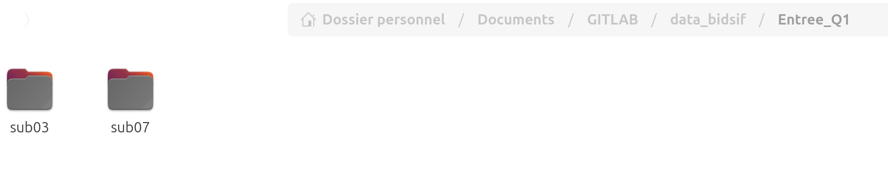
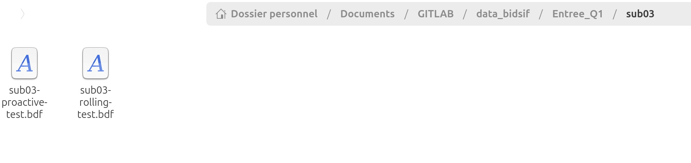
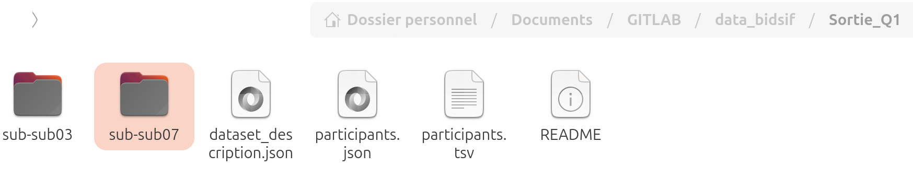

# BIDSIF

## Project decription

BIDS is a main format of metadata structure.

This code aims at bidsifying the EEG data recorded at CRPN.
The code was developed by A. Weill and A.-S Dubarry

The code to convert multiple BDF files into a single BIDS folder has been completed.
The code was written in Python and modularized.

## Ressource

Documentation on [BIDS EEG](https://https://bids-specification.readthedocs.io/en/stable/modality-specific-files/electroencephalography.html).

[MNE BIDS](https://mne.tools/mne-bids/stable/index.html) is used to create a BIDS-compatible directory of EEG or iEEG data.
MNE can load different data format :

BrainVision (.vhdr, .vmrk, .eeg)
European data format (.edf)
BioSemi data format (.bdf)
General data format (.gdf)
Neuroscan CNT (.cnt)
EGI simple binary (.egi)
EGI MFF (.mff)
EEGLAB files (.set, .fdt)
Nicolet (.data)
eXimia EEG data (.nxe)
Persyst EEG data (.lay, .dat)
Nihon Kohden EEG data (.eeg, .21e, .pnt, .log)
XDF data (.xdf, .xdfz)
see here for more details : see here https://mne.tools/stable/auto_tutorials/io/20_reading_eeg_data.html#sphx-glr-auto-tutorials-io-20-reading-eeg-data-py

**Warning! **
MNE-BIDS create good file organization, and create metadatafiles required for [BIDS-validator](https://bids-standard.github.io/bids-validator/), but some metadata are very poor and incomplete : just what's needed to validate.
THat's why it generate warnings from BIDS-validator.

A dataset generated with BIDS-MNE without metadata completed by humans can't be reused (critical informations will be missing).

# How to install and execute

Under Linux, in the project folder:

- Install pip:
  `sudo apt update sudo apt install python3-pip`
- Install the module for python virtual environments:
  sudo apt install python3-venv` `
- Create the python virtual environnement and activate it:`python3 -m venv .penv3.12` (for Python version 3.12)
  then `source .penv3.12/bin/activate`
- Once the virtual environment has been activated, install mne:
  `pip install mne`
  `pip install mne_bids`

Under Windows, in the project folder

* Install Python 3.12 in user mode, not “for all users”. Remember to check “pip” and "py" so that it's already installed. The default installation options should be correct.
* Create the python virtual environnement and activate it:`python3 -m venv .penv3.12` (for Python version 3.12)
  then `source .penv3.12/bin/activate`
* Once the virtual environment has been activated, install mne:
  `pip install mne`
  `pip install mne_bids`

For both systems

* Modify the “bids_configurator.txt” file for the “input_path” (subNN folder containing .bdf files) and “out_path” (bids folder) variables.
  *WARNING: paths must not be relative!*
  Other information can be modified in this file.

Here’s how to proceed:

* First, place the folders of the different subjects**"sub01"** ,**"sub02"** , etc., in the input folder, for example, your folder`/home/$USER/Documents/GITLAB/data_bidsif/Entree_Q1`(Linux) or `C:\Users\your_username\Documents\GITLAB\data_bidsif\Entree_Q1` (Windows)

- 
- In each subject folder **"subNN"** , the **associated BDF files** must be present.
- 
- In your working directory, for example, `/home/$USER/Documents/GITLAB/data_bidsif` (Linux) or `C:\Users\your_username\Documents\GITLAB\data_bidsif` (Windows), create the output folder, for instance, **`Sortie_Q1`** , which must be empty. If a BIDS folder has already been created, rerunning the script will update it.
- 
-
-
- In the file **"bids_configurator.txt"** , modify the parameters as follows, for example:
  Linux:

  ```
  input_path = "/home/your_username/Documents/GITLAB/BIDSIF/Entree_Q1"
  out_path = "/home/your_username/Documents/GITLAB/BIDSIF/Sortie_Q1"
  ```

  Windows:
  `input_path = "C:\Users\your_username\Documents\GITLAB\BIDSIF\Entree_Q1"`
  `out_path = "C:\Users\your_username\Documents\GITLAB\BIDSIF\Sortie_Q1"`
- Other parameters in the file must be filled in. You only need to provide the necessary information—nothing complicated.

To execute the code: `python create_bids_fron_n_bdf.py` ou `python3 create_bids_fron_n_bdf.py`
